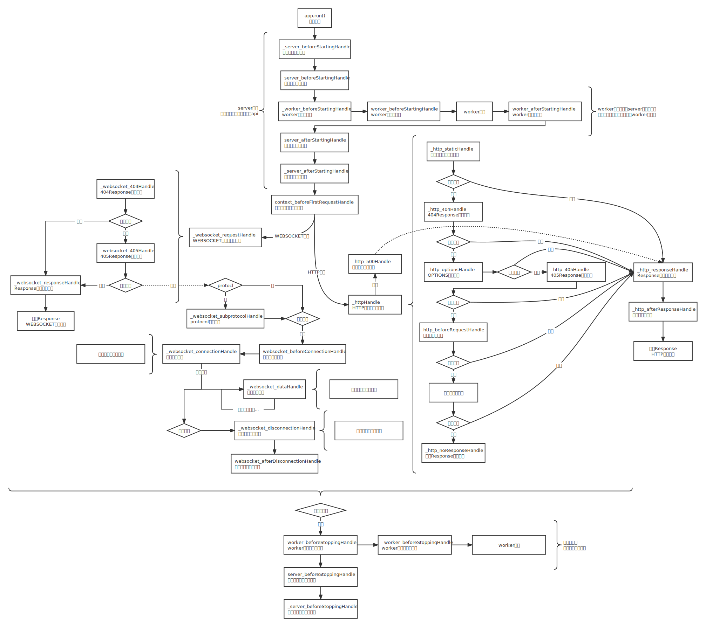

# **生命周期**

CheeseAPI有一套完整的生命周期。其中，名称前缀为`'_'`档为系统默认事件插槽，如果你是插件开发者，可能需要使用该插槽；其余事件插槽可供日常开发使用，并不会影响系统运行。



下列不再介绍系统默认事件插槽，插件开发者请查看[App - Handle](./App/Handle.md)。

一个事件插槽可以有多个执行函数，执行顺序遵循模块的导入顺序。

除了在生命周期中使用插槽，你还可以通过捕获信号以代替插槽，具体请查看[Signal](./Signal.md)。

## **服务器**

### **`@server_beforeStartingHandle`**

服务启动前事件插槽。

```python
from CheeseAPI import app

@app.handle.server_beforeStartingHandle
def test():
    ...
```

### **`@server_afterStartingHandle`**

服务器启动后事件插槽。该事件过后，服务器所有的功能应已完全启动。

```python
from CheeseAPI import app

@app.handle.server_afterStartingHandles
def test():
    ...
```

### **`@server_beforeStoppingHandle`**

服务器关闭前事件插槽。在该事件前，服务器以及不可访问；在该事件后，应当仅有日志系统还在输出剩余的内容，logger被摧毁后进程被关闭。

```python
from CheeseAPI import app

@app.handle.server_beforeStoppingHandle
def test():
    ...
```

## **Worker相关**

### **`@worker_beforeStartingHandle`**

worker启动前事件插槽。该事件会执行多次，次数为服务器的worker数量。

```python
from CheeseAPI import app

@app.handle.worker_beforeStartingHandle
def test():
    ...
```

### **`@worker_afterStartingHandle`**

worker启动后事件插槽。从理论上来说，已经可以访问API接口了。

```python
from CheeseAPI import app

@app.handle.worker_afterStartingHandle
def test():
    ...
```

### **`@worker_beforeStoppingHandle`**

worker停止后事件插槽。

```python
from CheeseAPI import app

@app.handle.worker_beforeStoppingHandle
def test():
    ...
```

## **`@context_beforeFirstRequestHandle`**

第一次请求之前事件插槽。该事件对HTTP和WEBSOCKET都有响应，仅执行一次。

```python
from CheeseAPI import app

@app.handle.context_beforeFirstRequestHandle
def test():
    ...
```

## **HTTP相关**

在插槽中返回[Response](./Response.md)以阻止返回自定义函数的[Response](./Response.md)是不可行的，如果需要对自定义函数返回的[Response](./Response.md)进行修改，请自行使用装饰器。

### **`@http_beforeRequestHandle`**

HTTP请求前事件插槽。该事件仅在自定义函数的路由中生效；获取静态资源、404、405等系统默认状态并不会触发该事件。

```python
from CheeseAPI import app, Request

@app.handle.http_beforeRequestHandle
def test(request: Request, **kwargs):
    ...
```

- **`request: Request`**

    获取当前请求的[Request](./Request.md)实例。

- **`kwargs`**

    其他参数，例如路由中的变量。

### **`@http_afterResponseHandle`**

HTTP返回响应后事件插槽。

```python
from CheeseAPI import app, Request, Response

@app.handle.http_afterResponseHandle
def test(request: Request, response: Response, **kwargs):
    ...
```

- **`request: Request`**

    获取当前请求的[Request](./Request.md)实例。

- **`response: Response`**

    获取当前请求返回的[Response](./Response.md)实例。

- **`kwargs`**

    其他参数，例如路由中的变量。

## **Websocket相关**

WEBSOCKET与HTTP有些许不同，具体如何使用请查看[Websocket](./Websocket.md)。

### **`@websocket_beforeConnectionHandle`**

WEBSOCKET连接前事件插槽。无法在此处对当前连接做任何操作，以及断开连接。如果需要在WEBSOCKET连接前做断连处理，请使用[Websocket - subprotocolHandle](./Websocket.md)。

```python
from CheeseAPI import app, Request

@app.handle.websocket_beforeConnectionHandle
def test(request: Request, subprotocol: str | None, **kwargs):
    ...
```

- **`request: Request`**

    获取当前请求的[Request](./Request.md)实例。

- **`subprotocol: str | None`**

    如果当前WEBSOCKET连接定义了子协议，则会返回规定的协议，否则返回`None`。

- **`kwargs`**

    其他参数，例如路由中的变量。

### **`@websocket_afterDisconnectionHandle`**

WEBSOCKET连接断开后事件插槽。

```python
from CheeseAPI import app, Request

@app.handle.websocket_afterDisconnectionHandle
def test(request: Request, subprotocol: str | None, **kwargs):
    ...
```

- **`request: Request`**

    获取当前请求的[Request](./Request.md)实例。

- **`subprotocol: str | None`**

    如果当前WEBSOCKET连接定义了子协议，则会返回规定的协议，否则返回`None`。

- **`kwargs`**

    其他参数，例如路由中的变量。

